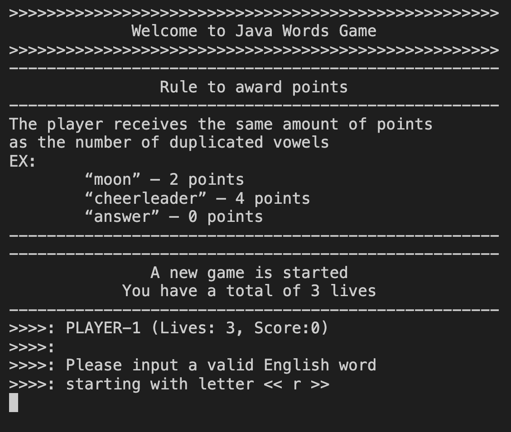
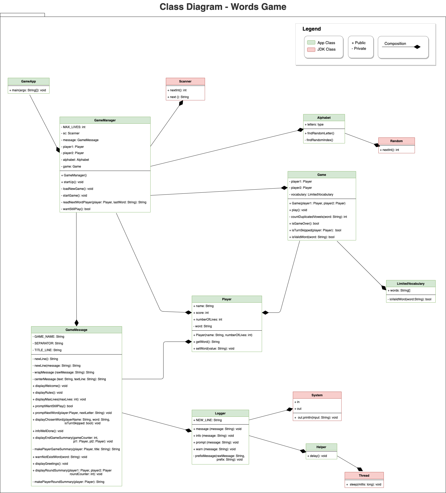

# Words Game

## Pre requiments

Install Java:
https://www.oracle.com/java/technologies/javase-jdk13-downloads.html

## Optional requiments
### Only if you want to use NodeJS + NPM

Install NodeJS:
https://nodejs.org/en/download/

-   `npm run java-clean` it removes all compiled JAVA files into the folder ./bin
-   `npm run java-compile` it compiles JAVA files into the folder ./src
-   `npm run java-run` it runs the class which contains the main() MorraGameApp
-   `npm run java-dev` it combines `java-compile` and `java-compile` in one single

## Preview App

{{:height="70px" width="40px"}

## UML class diagram:

{:height="50%" width="50%"}

# References

## UML Class diagramm Source (private)
https://app.diagrams.net/#G1hGi_mB3urb6xhiiI58UyscUojuXGqrPB

## JAVA Docs format:
https://www.tutorialspoint.com/java/java_documentation.htm
